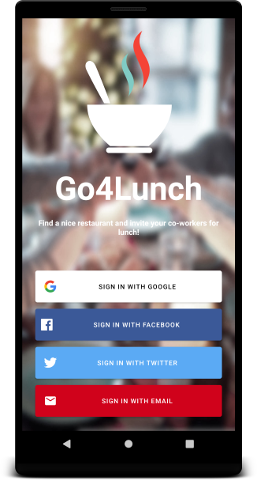
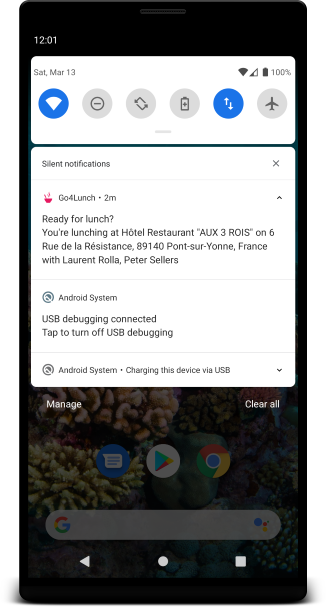

# Go4Lunch

This repository contains a mini-application for the P7 of the Grande École du Numérique pathway.

## Introduction

The **Go4Lunch** app is a collaborative app used by all employees. It allows you to search for a restaurant in the area, then select the one of your choice by telling your colleagues. Likewise, it is possible to consult the restaurants selected by colleagues in order to join them. A little before lunchtime, the application notifies the various employees to invite them to join their colleagues.

## Interface preview
 
  
  

 
## Getting Started
1. Download the project code, preferably with git clone.
2. Open Android Studio and click on "Check out project from Version Control" and click on Git.
3. Paste the url of the git repository in the "URL" field.
4. If necessary, modify the repository installation folder in the "Directory" field.
5. Synchronize the project with Gradle if necessary by clicking on the elephant icon.
6. A Google Maps api key is necessary to run teh app. You will have to register ig you don't have one.
7. Add your Google Map Api key in gradle.properties
8. Add gradle.properties in .gitignore file
9. You need to register to [Firebase](https://firebase.google.com/)
10. Add a project
11. Enable Authentication and Sign-methods : Google, Email , Facebook, Twitter
12. Enable Firestore and create rules accordingly
13. Compile the project by clicking on the hammer icon.
14. If necessary, select an android device and launch the project by clicking on the green arrow icon.
15. Enjoy the project and don't hesitate to contribute or report a bug on the project's Github repository.

## Built With
- [Java 8](https://www.oracle.com/java/technologies/java8.html) - World’s #1 development platform
- [Hilt](https://developer.android.com/training/dependency-injection/hilt-android) - Dependency injection library for Android
- [RxJava](https://github.com/ReactiveX/RxJava) - For asynchronous
- [Retrofit](https://square.github.io/retrofit/)  - Turns your HTTP API into a Java interface.
- [OkHttp](https://square.github.io/okhttp/) - Http client
- [FirebaseUI](https://firebase.google.com/docs/auth/web/firebaseui?hl=en)  -  A library built on top of the Firebase Authentication SDK that provides drop-in UI flows for use in your app.
- [FirebaseUi for Auth](https://github.com/firebase/FirebaseUI-Android/blob/master/auth/README.md)
- [Facebook Login](https://developers.facebook.com/docs/facebook-login/android/) - Web-based generic OAuth Login into your app using the Firebase SDK
- [Twitter Login](https://developer.twitter.com/en/portal/projects-and-apps) -  Web-based generic OAuth Login into your app using the Firebase SDK
- [Firestore](https://firebase.google.com/docs/firestore) - Flexible scalable NoSQL cloud database to store and sync data for client- and server-side development
- [Google Places API](https://developers.google.com/maps/documentation/places/web-service/overview) - The Places API is a service that returns information about places using HTTP requests. Places are defined within this API as establishments, geographic locations, or prominent points of interest.
- [NearBySearch Api](https://developers.google.com/maps/documentation/places/web-service/search)
- [PlaceDetail](https://developers.google.com/maps/documentation/places/web-service/details)
- [Place Autocomplete](https://developers.google.com/maps/documentation/places/web-service/autocomplete)  - Predictions
- [Google Maps SDK](https://developers.google.com/maps/documentation/android-sdk/overview?hl=fr) - Allow to easily add map to you app.
- [Android Architecture Components](https://developer.android.com/topic/libraries/architecture) :
  - [ViewModel](https://developer.android.com/topic/libraries/architecture/viewmodel) to stores UI-related data that isn't destroyed on app rotations.
  - [ViewBinding](https://developer.android.com/topic/libraries/view-binding) to generates a binding class for each XML layout file present in that module.
  - [DataBinding](https://developer.android.com/topic/libraries/data-binding) to to bind UI components in your layouts to data sources in your app using a declarative format rather than programmatically.
- [AlarmManager](https://developer.android.com/reference/android/app/AlarmManager) for notification
- [Notification](https://developer.android.com/training/notify-user/build-notification)- Provide short, timely information about events in your app while it's not in use.
- [Localization](https://developer.android.com/guide/topics/resources/localization) - English and French
- [Espresso](https://developer.android.com/training/testing/ui-testing/espresso-testing) - Provides APIs for writing UI tests to simulate user interactions within a single target app.

