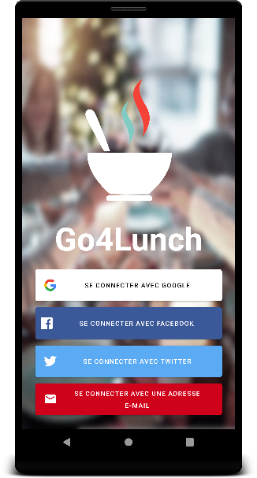
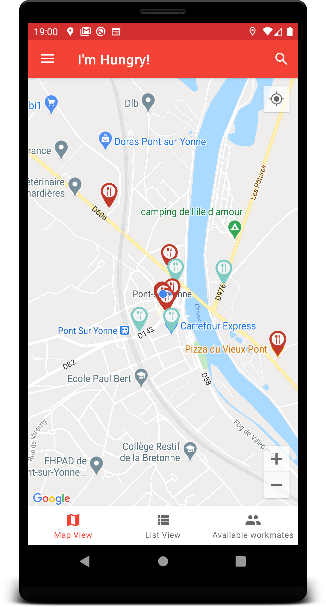
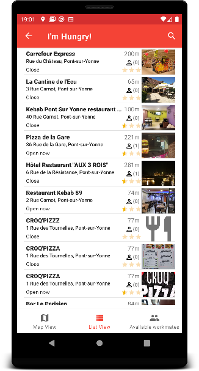
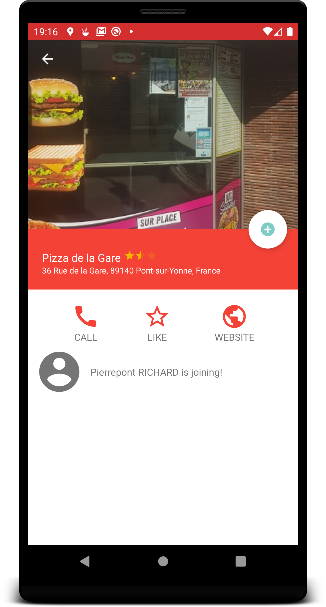
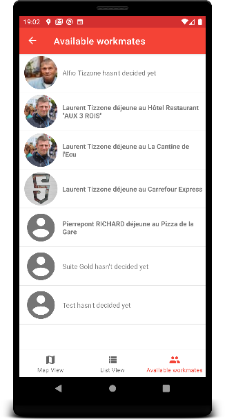
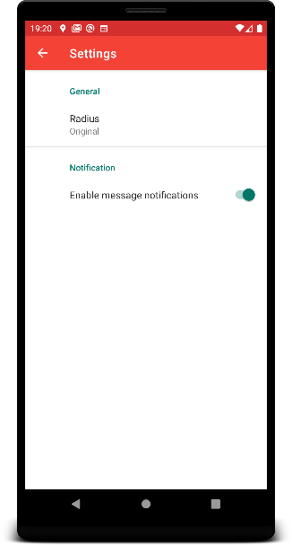
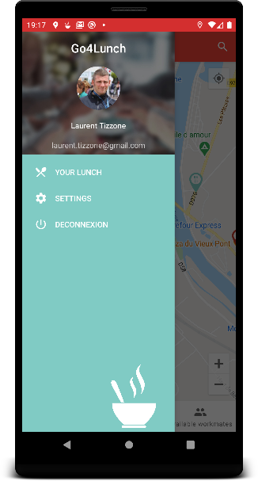

# Go4Lunch

This repository contains a mini-application for the P7 of the Grande École du Numérique pathway.

## Introduction

The Go4Lunch app is a collaborative app used by all employees. It allows you to search for a restaurant in the area, then select the one of your choice by telling your colleagues. Likewise, it is possible to consult the restaurants selected by colleagues in order to join them. A little before lunchtime, the application notifies the various employees to invite them to join their colleagues.

## Interface preview
 
  

## Configure the project in Android Studio
======================================

### 1. Download the project code, preferably with git clone.

### 2. Open Android Studio and click on "Check out project from Version Control" and click on Git.
### 3. Paste the url of the git repository in the "URL" field.
### 4. If necessary, modify the repository installation folder in the "Directory" field.

### 5. Synchronize the project with Gradle if necessary by clicking on the elephant icon.
### 6. Compile the project by clicking on the hammer icon.
### 7. If necessary, select an android device and launch the project by clicking on the green arrow icon.

### 8. Enjoy the project and don't hesitate to contribute or report a bug on the project's Github repository.
